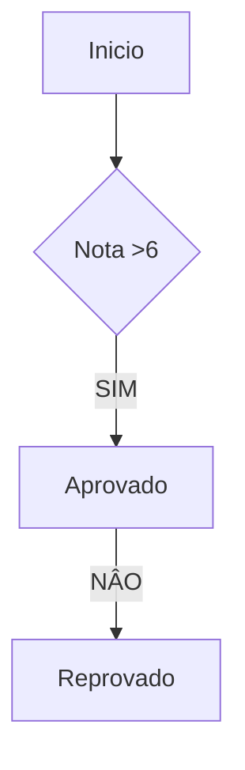

```mermaid

flowchart TD
  A([Inicio])
  A --> B{Faça uma escolha}
  B --> C[OP1]
  B --> E[OP2]
  B --> D[OP3]

```

```mermaid
graph TD;
  A[Inicio] --> B{Nota >6};
  B --> |SIM| C[Aprovado];
  C --> |NÂO| D[Reprovado];
```

```mermaid
gantt
  title Exemplo de Gráfico de Gantt
  dateFormat YYYY-MM-DD
  section 1° Bimestre
  section 2° Bimestre
```

